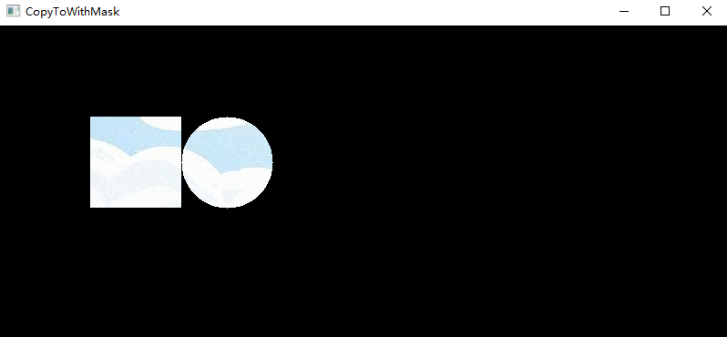
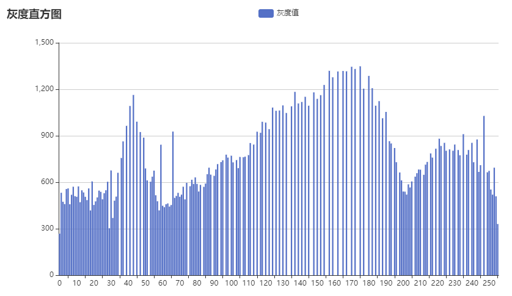

`func NewWindow(name string) *Window`

创建窗口，可以创建多个，但是名称要不一样。

opencv中的GUI是由`HighGUI`这个组件提供的。

`func (w *Window) WaitKey(delay int) int`

用于阻塞当前线程，否则窗口会一闪而过。如果参数为0就会一直阻塞，直到有按键事件；如果大于0，就会等待相应的毫秒然后解除阻塞，或者有按键事件就会立即解除阻塞。返回值为按键的code，如果没有按键则返回值为-1。如果有多个窗口，只需要调用一次 WaitKey 会同时生效。

`func IMRead(name string, flags IMReadFlag) Mat`

加载图片文件。常用的读取模式：1、`IMReadColor`读取出来的为彩色图片，拥有三个通道，opencv中的通道顺序为`BGR`，而不是`RGB`；2、`IMReadGrayScale`读取出来的为黑白照片，只有一个通道。支持的图片格式很多，比如常用的`jpg,jpeg,png,bmp,webp,awf`，具体可以看文档，不支持`gif`。

`gocv.Mat`矩阵结构，它由两部分组成，一个是 matrix header，这部分大小是固定的，包含矩阵的大小，存储的方式，矩阵存储的地址等等，另一部分是一个指针，指向了矩阵元素。这类似于切片结构，因此应该使用`Clone()`或者`CopyTo()`函数来实现赋值和拷贝，否则对 Mat 的操作会相互影响，因为普通的赋值只复制了header，而底层的数据指针是一样的，这一做的好处是避免了矩阵的重复分配内存。

```c++
// https://github.com/opencv/opencv/blob/4.7.0/modules/core/include/opencv2/core/mat.hpp

class CV_EXPORTS Mat
{
	...
 
    int dims;  /*数据的维数*/
    int rows,cols; /*行和列的数量;数组超过2维时为(-1，-1)*/
    uchar *data;   /*指向数据*/
    int * refcount;   /*指针的引用计数器; 阵列指向用户分配的数据时，指针为 NULL*/

    int flags; // 重点讲解
    //! the matrix dimensionality, >= 2，数据的维数
    int dims;
    //! the number of rows and columns or (-1, -1) when the matrix has more than 2 dimensions
    int rows, cols;
    //! pointer to the data，指向数据
    uchar* data;

    //! helper fields used in locateROI and adjustROI
    const uchar* datastart;
    const uchar* dataend;
    const uchar* datalimit;

    //! custom allocator
    MatAllocator* allocator;
    //! and the standard allocator
    static MatAllocator* getStdAllocator();
    static MatAllocator* getDefaultAllocator();
    static void setDefaultAllocator(MatAllocator* allocator);

    //! internal use method: updates the continuity flag
    void updateContinuityFlag();

    //! interaction with UMat
    UMatData* u;

    MatSize size;
    MatStep step;
 
	...
 
};
```

上面的`int flags`属性，占用32位，从低位到高位

```bash
0-2位代表depth即数据类型（如CV_8U），OpenCV的数据类型共7类，故只需3位即可全部表示。

3-11位代表通道数channels，因为OpenCV默认最大通道数为512，故只需要9位即可全部表示，可参照下面求通道数的部分。

0-11位共同代表type即通道数和数据类型（如CV_8UC3）

12-13位暂没发现用处，也许是留着后用，待发现了再补上。

14位代表Mat的内存是否连续，一般由creat创建的mat均是连续的，如果是连续，将加快对数据的访问。

15位代表该Mat是否为某一个Mat的submatrix，一般通过ROI以及row()、col()、rowRange()、colRange()等得到的mat均为submatrix。

16-31代表magic signature，暂理解为用来区分Mat的类型，如Mat和SparseMat
```

`MatType`矩阵的类型，包含了元素的数据类型depth以及通道个数，比如`MatTypeCV8UC3`代表`8 uint and channel 3`，所以depth为`MatTypeCV8U`，depth不考虑通道，depth的取值是从0到6。

`ElemSize()`返回矩阵中一个元素占用的字节数，比如`MatTypeCV8UC3`每个元素占用字节数为3。

```go
// 关于行数，列数，通道的关系
// Total 是像素点的个数，row * col
// 矩阵变换
func Run7() {
	m1 := gocv.NewMatWithSize(20, 30, gocv.MatTypeCV8UC1)
	fmt.Printf("size:%v, elemSize:%v, type:%v, total:%v, channels:%v\n", m1.Size(), m1.ElemSize(), m1.Type(), m1.Total(), m1.Channels())
	// 	size:[20 30], elemSize:1, type:CV8U, total:600, channels:1

	// cn int 通道数，0表示保持原通道数不变
	// rows int 矩阵行数，0表示保持原行数不变，列数会自动计算
	// 变换规则：row1 * col1 * channel1 == row2 * col2 * channel2
	m2 := m1.Reshape(2, 20) // 2通道，20行N列
	fmt.Printf("size:%v, elemSize:%v, type:%v, total:%v, channels:%v\n", m2.Size(), m2.ElemSize(), m2.Type(), m2.Total(), m2.Channels())
	// size:[20 15], elemSize:2, type:CV8UC2, total:300, channels:2

	m3 := m1.Reshape(1, 1) // 1通道，1行N列
	fmt.Printf("size:%v, elemSize:%v, type:%v, total:%v, channels:%v\n", m3.Size(), m3.ElemSize(), m3.Type(), m3.Total(), m3.Channels())
	// size:[1 600], elemSize:1, type:CV8U, total:600, channels:1

	m4 := m3.T() // 转置操作，得到 N行1列，1通道
	fmt.Printf("size:%v, elemSize:%v, type:%v, total:%v, channels:%v\n", m4.Size(), m4.ElemSize(), m4.Type(), m4.Total(), m4.Channels())
	// size:[600 1], elemSize:1, type:CV8U, total:600, channels:1

	m5, err := gocv.NewMatFromBytes(2, 3, gocv.MatTypeCV8UC3, []byte{1, 2, 3, 4, 5, 6, 7, 8, 9, 10, 11, 12, 13, 14, 15, 16, 17, 18})
	if err != nil {
		fmt.Println(err)
		return
	}
	fmt.Printf("size:%v, elemSize:%v, type:%v, total:%v, channels:%v\n", m5.Size(), m5.ElemSize(), m5.Type(), m5.Total(), m5.Channels())
	// size:[2 3], elemSize:3, type:CV8UC3, total:6, channels:3

	m6 := m5.RowRange(0, 1) // 获取部分行组成新矩阵
	fmt.Printf("size:%v, elemSize:%v, type:%v, total:%v, channels:%v\n", m6.Size(), m6.ElemSize(), m6.Type(), m6.Total(), m6.Channels())
	// size:[1 3], elemSize:3, type:CV8UC3, total:3, channels:3

	// 打印矩阵数据，元素的个数为 row * col * channel
	sli, err := m6.DataPtrUint8()
	if err != nil {
		fmt.Println(err)
		return
	}
	fmt.Println(sli) // [1 2 3 4 5 6 7 8 9]

	fmt.Println(m1.Step()) // 30，返回每一行占用的字节数
}
```

`Mat.reshape()`只是改变了矩阵的形状，改变前后切片内的值的个数不变，即`row1 * col1 * channel1 == row2 * col2 * channel2`；而`gocv.resize()`是改变图像的宽高，并不保证切片内的值的个数不变。

```go
func Resize(src Mat, dst *Mat, sz image.Point, fx, fy float64, interp InterpolationFlags)
```

`zs`：目标图像的size，gocv中通过`image.Pioint{}`来传递宽高，不要奇怪。

`fx, fy`：分别是X方向和Y方向的缩放比例，如果指定了`fx,fy`那么就不用传`sz`。同样的，如果指定了`sz`那么久不用传`fx,fy`。

`interp`：指定使用那种插值算法，因为图片的缩放效果跟使用那种插值算法有关，默认的是线性插值 Linear，即 `gocv.InterpolationLinear`。

你可能会很好奇矩阵的数据部分点阵是怎么存储的，对于彩色图片来说，它是二维的 M*N，但是它有三个通道，我们有必要搞清楚它是怎么存储的。

```go
func Run11() {
    srcImage := gocv.IMRead("showimage/cat.jpg", gocv.IMReadColor)
    
    // 拆分通道，此处将3通道的数据拆分成，三个单通道的数据，依次为 B G R
	imgs := gocv.Split(srcImage)
    
    bm := imgs[0].ToBytes()
	fmt.Println("bm", bm[:12])
    
	gm := imgs[1].ToBytes()
	fmt.Println("gm", gm[:12])
    
	rm := imgs[2].ToBytes()
	fmt.Println("rm", rm[:12])
    
    sm := srcImage.ToBytes()
	fmt.Println("sm", sm[:36])
}
```

打印：

```bash
bm [53 54 54 55 55 56 56 56 58 59 62 65]
gm [55 56 56 57 57 58 58 58 59 60 63 66]
rm [95 96 96 97 98 99 99 99 103 104 107 110]
sm [53 55 95 54 56 96 54 56 96 55 57 97 55 57 98 56 58 99 56 58 99 56 58 99 58 59 103 59 60 104 62 63 107 65 66 110]
```

从数据上我们很容易就看出来，其组织顺序为 `[B G R B G R B G R B G R ...]`

opencv不支持中文的文件名，可以先使用golang的方法读取到文件内容，然后 IMDecode 转换成 Mat。

##### GOCV错误码处理

如果出现报错，会看到如下信息

```bash
Exception 0x20474343 0x2c0e89231c0 0x0 0x7ffc5909a388
PC=0x7ffc5909a388
signal arrived during external code execution

runtime.cgocall(0x1c2840, 0xc000107d58)
...
```

完全不知道错在哪了，但是还没找到方法。gocv [issue](https://github.com/hybridgroup/gocv/issues/274) 也有这样的讨论，这归咎于cgo程序，出现异常程序就直接退出，唯一的办法是做好参数校验。

##### 图像中的频率

图像的频率：灰度值变化剧烈程度的指标，是灰度在平面空间上的梯度。

**低频**：就是颜色缓慢地变化，也就是灰度缓慢地变化,就代表着那是连续渐变的一块区域，这部分就是低频。对于一幅图像来说，除去高频的就是低频了，也就是边缘以内的内容为低频，而边缘内的内容就是图像的大部分信息，即图像的大致概貌和轮廓，是图像的近似信息。

**高频**：就是相邻区域之间灰度相差很大，这就是变化得快，图像中，一个影像与背景的边缘部位，通常会有明显的差别，也就是说变化那条边线那里，灰度变化很快，也即是变化频率高的部位，因此，图像边缘的灰度值变化快，就对应着频率高，即高频显示图像边缘。图像的细节处也是属于灰度值急剧变化的区域，正是因为灰度值的急剧变化，才会出现细节。      另外噪声（即噪点）也是这样,，在一个像素所在的位置，之所以是噪点，就是因为它与正常的点颜色不一样了，也就是说该像素点灰度值明显不一样了，也就是灰度有快速地变化了，所以是高频部分，因此有噪声在高频这么一说。

##### 图像翻转

```go
func Run5() {
	srcImage := gocv.IMRead("showimage/cat.jpg", gocv.IMReadColor)
	util.ShowImage("翻转-前", srcImage, false)

	dstImage := gocv.NewMat()
	// 0 - 沿着水平线翻转
	// 1 - 沿着垂直线翻转
	// -1 - 沿着水平和垂直线翻转
	gocv.Flip(srcImage, &dstImage, -1)

	util.ShowImage("翻转-后", dstImage, true)
}
```


##### 图像阈值化/二值化

所谓阈值化，就是达到某个阈值的时候就被设置为另外一个值。

当灰度值大于一个值(阀值)时，让其成为一个大的值。 比如:灰度在0-255，当灰度小于128时赋值为0，大于128时赋值为255，即亮的地方更亮,暗的地方更暗。即实现了阀值分割，这样图像就黑白分明，对比度加大了。 阀值处理后使图象只有几种颜色如最通常的分为了黑白的二值图象。

```c++
threshold	(	InputArray 	src,
                OutputArray 	dst,
                double 	thresh,
                double 	maxval,
                int 	type 
)	
```

`thresh`比较直。

`maxval`在类型`THRESH_BINARY and THRESH_BINARY_INV`的时候会被用到。

`type`阈值化规则，可选值如下。


`THRESH_BINARY`：二进制阈值，新的阈值产生规则可为：`value > thresh ? maxval : 0`

`THRESH_BINARY INV`：反二进制阈值，新的阈值产生规则可为：`value > thresh ? 0: maxval `

`THRESH_TRUNC`：截断阈值，新的阈值产生规则可为：`value > thresh ? thresh : value`

`THRESH_TOZERO`：阈值化为0，新的阈值产生规则可为：` value > thresh ? value : 0`

`THRESH_TOZERO_INV`：反阈值化为0，新的阈值产生规则可为：`value > thresh ? 0 : value`

```go
// 图像阈值化
func Run6() {
	srcImage := gocv.IMRead("showimage/cat.jpg", gocv.IMReadColor)
	util.ShowImage("原图", srcImage, false)

	grayImage := gocv.NewMat()
	gocv.CvtColor(srcImage, &grayImage, gocv.ColorBGRToGray)
	util.ShowImage("灰度", grayImage, false)

	dstImage := gocv.NewMat()
	gocv.Threshold(grayImage, &dstImage, 125, 255, gocv.ThresholdBinary)
	util.ShowImage("ThresholdBinary", dstImage, true)
}
```


自适应阈值的二值化，可以通过比较像素点与周围像素点的关系动态调整阈值。`gocv.AdaptiveThreshold()`


##### 图像腐蚀与膨胀

```go
func Run3() {
	img := gocv.IMRead("showimage/cat.jpg", gocv.IMReadColor)
	util.ShowImage("原图", img, false)

	// 设置腐蚀块大小，gocv中使用 image.Point 来设置宽高
	elem := gocv.GetStructuringElement(gocv.MorphRect, image.Point{15, 15})

	dst := gocv.NewMat()
	gocv.Erode(img, &dst, elem) // 腐蚀操作
	util.ShowImage("图像腐蚀-后", dst, false)

	dst2 := gocv.NewMat()
	gocv.Dilate(img, &dst2, elem) // 膨胀操作
	util.ShowImage("图像膨胀-后", dst2, true)
}
```


腐蚀的作用就是让暗的区域变大（它是在一个区域内找0），而膨胀的作用就是让亮的区域变大（它是在一个区域内找255）。而最终的结果很大程度上取决于“核”的形状和大小，“核”的形状有方形、X形、椭圆形。

“核”就是对比的对象，上例中，我们设置了15X15的方形区域，其实就是一个矩阵，该矩阵每个点填充1，然后拿着这个矩阵从图像左上角开始对比，符合一定的条件就将图像上的某个像素点置为0或者255。

最典型的一个应用场景就是在你`二值化`后，你的目标和背景抠的不是很干净，比如里面还有一些干扰点或者干扰线，可以试试两个操作，有时候效果出奇的好。

一般是对二值化后的图像来进行腐蚀操作，这样就是图形更加分明。处理图形周围的毛刺。每执行一次腐蚀操作，都会把图像多腐蚀一圈。

核的大小也会影响腐蚀的效果，核越小腐蚀的越多。


##### 边缘检测

通俗来讲就是试图勾勒出物体轮廓。

```go
func Run4() {
	srcImage := gocv.IMRead("showimage/cat.jpg", gocv.IMReadColor)
	util.ShowImage("边缘检测-前", srcImage, false)

	// 将原始图像转换为灰度图像
	grayImage := gocv.NewMat()
    // ColorBGRToGray 会将 BGR 三色相加然后平均得到灰度值
	gocv.CvtColor(srcImage, &grayImage, gocv.ColorBGRToGray)
	util.ShowImage("灰度", grayImage, false)

	// 先用3*3内核来降噪，模糊处理
	edge := gocv.NewMat()
	gocv.Blur(grayImage, &edge, image.Point{3, 3})
	util.ShowImage("降噪", edge, false)

	// 运行canny算子
	dstImage := gocv.NewMat()
	gocv.Canny(edge, &dstImage, 3, 9)

	util.ShowImage("边缘检测-后", dstImage, true)
}
```


典型的卷积核：

1、纵向边缘检测

```bash
1  0  -1
1  0  -1
1  0  -1
```

如果存在纵向的分界，那么靠近分界左右的灰度值相差比较大，不靠近分界的灰度差值较小。

在差值小的地方，比如差值为2，经过`1`和`-1`的相乘相加，因为有3次，结果为6。

在差值大的地方，比如差值为10，同样的也是3次相乘相加，结果为30。

再来感受一下，原先的对比是 10-2=8，卷积运算后的对比是 30-6=24，放大了3倍，边界附近就变得更明显了。

再者，在灰度值变化不大的地方，经过`1`和`-1`的相乘相加，结果就趋近于0，

2、横向边缘检测

```bash
1  1  1
0  0  0
-1 -1 -1
```

3、sobel Filter

```bash
1  0  -1
2  0  -2
1  0  -1
```

旋转90度可以得到对应的水平过滤器

4、scharr Filter

```bash
3   0  -3
10  0  -10
3   0  -3
```

旋转90度可以得到对应的水平过滤器


##### 关于图像的 模糊处理/平滑处理/降噪处理/滤波处理

在opencv中，可能使用blur对图像进行平滑处理，这种方法就是最简单的求平均数。平滑也称模糊, 是一项简单且使用频率很高的图像处理方法。平滑处理的用途有很多， 但是在很多地方我们仅仅关注它减少噪声的功用。平滑处理时需要用到一个滤波器Filter，滤波器也被称为 “核”、“模板”、“窗口”、“掩模”、“算子”，一般在信号处理中称为 “滤波器”，在数学领域称为 “核”。 最常用的滤波器是线性滤波器。

滤波的原理和腐蚀膨胀类似，都是由`核`遍历计算。核的边长一般设置为奇数，比如`3x3`。

1、`blur`均值滤波

基于二维离散卷积

核所覆盖的像素点的均值作为核中心处的颜色值。

文档地址：https://docs.opencv.org/4.x/d4/d86/group__imgproc__filter.html#ga8c45db9afe636703801b0b2e440fce37

```c++
blur	(	InputArray 	src,
            OutputArray  dst,
            Size 		ksize,
            Point 		anchor = Point(-1,-1),
            int 		borderType = BORDER_DEFAULT 
)	
```

`ksize`为滤波器大小。

`anchor`指定锚点位置(被平滑点)， 如果是负值，取核的中心为锚点。

`borderType`推断边缘像素，一般取默认值`BORDER_DEFAULT`。这个参数在很多地方都有需要彻底理解，我们的目标是将src做一些变换然后放到dst里面去，如果dst的尺寸比src大，那么就会使用这个`borderType`来填充多余的部分，否则这个参数就没有作用。比如我们经常使用`dst := gocv.NewMat()`来初始化一个空的矩阵，那么`borderType`就起不到作用。

2、`GaussianBlur`高斯滤波

基于二维离散卷积

```c++
GaussianBlur	(	InputArray 	src,
                    OutputArray 	dst,
                    Size 	ksize,
                    double 	sigmaX,
                    double 	sigmaY = 0,
                    int 	borderType = BORDER_DEFAULT 
)	
```

将输入数组的每一个像素点与`高斯内核`卷积，将卷积和当作输出像素值。因为核覆盖的面积上，各个像素点距离核中心的距离不一样，导致颜色的贡献程度不一样，高斯滤波就是给不同的点不同的权重最终计算出核中心点的颜色值。

`sigmaX`x方向的标准方差。可设置为0让系统自动计算。

`sigmaY`y方向的标准方差。可设置为0让系统自动计算。

3、`medianBlur`中值滤波

基于统计方法的

```c++
medianBlur	(	InputArray 	src,
                OutputArray 	dst,
                int 	ksize 
)	
```

将图像的每个像素用邻域 (以当前像素为中心的正方形区域)像素的中值代替，中值值的是从大到小排序后中间的值，而不是平均值。

中值滤波非常适合处理细小的噪音点颗粒。

4、`bilateralFilter`双边滤波

```c++
bilateralFilter	(	InputArray 	src,
                    OutputArray 	dst,
                    int 	d,
                    double 	sigmaColor,
                    double 	sigmaSpace,
                    int 	borderType = BORDER_DEFAULT 
)	
```

执行双边滤波操作,类似于高斯滤波器，双边滤波器也给每一个邻域像素分配一个加权系数。 这些加权系数包含两个部分, 第一部分加权方式与高斯滤波一样，第二部分的权重则取决于该邻域像素与当前像素的灰度差值。

`d`像素的邻域直径。

`sigmaColor`颜色空间的标准方差。

`sigmaSpace`坐标空间的标准方差(像素单位)。


##### 关于一屏多图

上面的示例中我们经常需要开启多个窗口来展示多个图片，比较麻烦，其实也可以在一个窗口中同时展示多个图片，其原理就是将多个图片编排到一个大的`Mat`中去，需要用到`Mat.Regin()`，得到的新Mat和原来的Mat是引用关系，我们将图片`CopyTo`到新Mat里去即可。需要注意的是，此方法要求这些图片的通道数一致，尺寸的话不做要求，可以`resize`之后再来编排。

```go
// imgCols 一行展示几个图片
func ShowMultipleImage(title string, imgs []gocv.Mat, imgCols int) {
	if imgs == nil {
		return
	}
	imgNum := len(imgs)
	imgOriSize := imgs[0].Size() // [行数 列数]
	imgDst := gocv.NewMatWithSize(imgOriSize[0]*((imgNum-1)/imgCols+1), imgOriSize[1]*imgCols, imgs[0].Type())
	imgChannel := 3 // 都转换成 BGR 通道

	m := gocv.NewMat()
	for i := 0; i < imgNum; i++ {
		// 像素点位置
		x0 := (i % imgCols) * imgOriSize[1]
		y0 := (i / imgCols) * imgOriSize[0]
		x1 := x0 + imgOriSize[1]
		y1 := y0 + imgOriSize[0]

		// Region 返回的 Mat 和原始的 Mat是引用关系，操作是相互影响的
		regin := imgDst.Region(image.Rect(x0, y0, x1, y1))
		if imgs[i].Channels() != imgChannel {
			gocv.CvtColor(imgs[i], &m, gocv.ColorGrayToBGR)
			m.CopyTo(&regin)
		} else {
			imgs[i].CopyTo(&regin)
		}
	}

	w := gocv.NewWindow(title)
	// imgDst 是一个整体，要求每一块的通道数一样，否则就不是一个合格的 Mat，无法展示。
	w.IMShow(imgDst)
	w.WaitKey(0)
}
```


##### 读取GIF图像

opencv中无法读取gif图像，这是由于license原因。转而使用 videocapture 或者第三方的 PIL 库（Python），但是其实Golang的基础库`image`中就有读取gif图像的。于是一个简单的示例如下

```go
func ReadAndShowGIF(filename string) {
	w := gocv.NewWindow(filename)

	f, _ := os.Open(filename)
	defer f.Close()

	gi, _ := gif.DecodeAll(f)

	for k, v := range gi.Image {
		img, err := gocv.ImageToMatRGB(v)
		if err != nil {
			log.Fatal(err)
		}

		w.IMShow(img)
		w.WaitKey(gi.Delay[k] * 10) // delay 单位是百分之一秒，waitkey参数为毫秒
	}

	w.WaitKey(0)
}
```

这里只会播放一遍gif图像，我们还可以解析gif中的LoopCount来增加循环播放的逻辑。

##### 读取mp4视频文件

首先要确保cmake安装的时候成功安装了`opencv_ffmpeg_64.dll and opencv_ffmpeg.dll`依赖，否则在调用`gocv.VideoCaptureFile`或者`gocv.OpenVideoCapture`的时候会报错`Error opening file: showimage/video1.mp4`。

打开opencv编译安装的路径下`C:\opencv\build\lib`，的确没找到这两依赖，那怎么办呢？

opencv在编译的时候会首先查找当前系统有没有安装ffmpeg，如果没有安装才会去下载安装，但是可能是在下载的时候失败了，所以就没有安装这个依赖，下载失败的日志可以在`opencv/build/CMakeDownloadLog.txt`找到，因此，我打开了梯子软件来重新编译opencv就可以了，不用梯子的话我还没试过怎么解决。

读取视频文件使用`gocv.VideoCaptureFile(filename)`或者`gocv.OpenVideoCapture(filename)`，然后逐帧处理

```go
func ReadAndShowVideo(filename string) {
	w := gocv.NewWindow(filename)
	vc, err := gocv.VideoCaptureFile(filename)
	if err != nil {
		fmt.Println(err)
		return
	}

	mat := gocv.NewMat()

	for {
		if vc.Read(&mat) {
			w.IMShow(mat)
			w.WaitKey(10)
		} else {
			break
		}
	}
	w.WaitKey(0)
}
```

其实也可以使用`ReadAndShowVideo`函数来读取GIF图像，但是不如`ReadAndShowGIF`控制的更细致。

##### 拆分通道与合并通道

比如将3通道的图像拆分成3个单通道的数据。单通道的图像直接展示就是灰度图。

```go
func Run12() {
	srcImage := gocv.IMRead("showimage/cat.jpg", gocv.IMReadColor)
	imgs := gocv.Split(srcImage)

	basicb := make([]byte, srcImage.Channels()*srcImage.Total())
	bm := imgs[0].ToBytes()
	for k := range basicb {
		if k%3 == 0 {
			basicb[k] = bm[k/3]
		}
	}
	b, err := gocv.NewMatWithSizesFromBytes(srcImage.Size(), srcImage.Type(), basicb)
	if err != nil {
		log.Fatal(err)
	}

	basicg := make([]byte, srcImage.Channels()*srcImage.Total())
	gm := imgs[1].ToBytes()
	for k := range basicg {
		if k%3 == 1 {
			basicg[k] = gm[k/3]
		}
	}
	g, err := gocv.NewMatWithSizesFromBytes(srcImage.Size(), srcImage.Type(), basicg)
	if err != nil {
		log.Fatal(err)
	}

	basicr := make([]byte, srcImage.Channels()*srcImage.Total())
	rm := imgs[2].ToBytes()
	for k := range basicr {
		if k%3 == 2 {
			basicr[k] = rm[k/3]
		}
	}
	r, err := gocv.NewMatWithSizesFromBytes(srcImage.Size(), srcImage.Type(), basicr)
	if err != nil {
		log.Fatal(err)
	}

	util.ShowMultipleImage("mat split", []gocv.Mat{srcImage, b, g, r}, 2)
}
```


代码有些长，实际上gocv提供了对 Mat 的 Merge 操作，如下

```go
func Run13() {
	srcImage := gocv.IMRead("showimage/cat.jpg", gocv.IMReadColor)
	imgs := gocv.Split(srcImage) // B G R

	basic := make([]byte, srcImage.Total())
	basicMat, err := gocv.NewMatWithSizesFromBytes(srcImage.Size(), gocv.MatTypeCV8UC1, basic)
	if err != nil {
		log.Fatal(err)
	}

	b := gocv.NewMat()
	gocv.Merge([]gocv.Mat{imgs[0], basicMat, basicMat}, &b)
	g := gocv.NewMat()
	gocv.Merge([]gocv.Mat{basicMat, imgs[1], basicMat}, &g)
	r := gocv.NewMat()
	gocv.Merge([]gocv.Mat{basicMat, basicMat, imgs[2]}, &r)

	util.ShowMultipleImage("mat split", []gocv.Mat{srcImage, b, g, r}, 2)
}
```

##### 关于Scalar

在初始化一个Mat的时候，默认都是0，也就是黑色的，使用Scalar我们可以给与一个初始的颜色值，提供四个通道`BGRA`，

```go
func Run14() {
	scalar := gocv.NewScalar(255, 0, 0, 0)
	m := gocv.NewMatWithSizesWithScalar([]int{200, 200}, gocv.MatTypeCV8UC3, scalar)
	fmt.Println(m.Size(), m.Channels(), m.Total(), m.ElemSize())
	util.ShowImage("Scalar", m, true)
}
```


##### 图像拼接

```go
func Run16() {
	scalar1 := gocv.NewScalar(255, 0, 0, 0)
	m1 := gocv.NewMatWithSizesWithScalar([]int{200, 200}, gocv.MatTypeCV8UC3, scalar1)

	scalar2 := gocv.NewScalar(0, 255, 0, 0)
	m2 := gocv.NewMatWithSizesWithScalar([]int{200, 200}, gocv.MatTypeCV8UC3, scalar2)

	scalar3 := gocv.NewScalar(0, 0, 255, 0)
	m3 := gocv.NewMatWithSizesWithScalar([]int{200, 200}, gocv.MatTypeCV8UC3, scalar3)

	dst1 := gocv.NewMat()
	// 沿水平堆叠，要求行数必须一致
	gocv.Hconcat(m1, m2, &dst1)
	util.ShowImage("Hconcat", dst1, false)

	dst2 := gocv.NewMat()
	// 垂直方向堆叠，要求列数必须相同，因此此处会报错
	gocv.Vconcat(dst1, m3, &dst2)

	util.ShowImage("Vconcat", dst2, true)
}
```

##### 图像的Add和AddWeight操作

图像相加，也就是混合，要求尺寸和通道数完全一致。

```go
func Run17() {
	iconImage := gocv.IMRead("showimage/gongfu.jpg", gocv.IMReadColor)
	iconSize := iconImage.Size()
	backImage := gocv.IMRead("showimage/girl.jpg", gocv.IMReadColor)

	alpha, beta, gamma := 1.0, 0.0, 0.0
	backRegin := backImage.Region(image.Rect(10, 10, 10+iconSize[1], 10+iconSize[0]))
	dstImage := gocv.NewMat()

	// add, addWeight 要求尺寸和通道数完全一致
	// alpha, beta 分别表示第一个和第二个的权重，0-1之间，通常 alpha+beta=1
	// gamma 灰度系数，图像校正的偏移量，用于调节亮度，dst = src1 * alpha + src2 * beta + gamma
	gocv.AddWeighted(iconImage, alpha, backRegin, beta, gamma, &dstImage)

	dstImage.CopyTo(&backRegin)
	util.ShowImage("addWeight", backImage, true)
}
```


##### 蒙版操作mask

蒙版是一块8位的灰度值图像，也就是只有一个通道，且类型为`uint8`或者`uchar`。蒙版的尺寸跟源图像的尺寸要一致，否则无法计算，蒙版的像素值255表示接受，0表示过滤掉，中间值则是中间效果。

```go
func Run18() {
	src := gocv.IMRead("showimage/girl.jpg", gocv.IMReadColor)
	// 蒙版尺寸与源图像的尺寸要一致
	// 蒙版为 8位灰度格式，0表示过滤掉，255表示接受
	mask := gocv.NewMatWithSize(src.Size()[0], src.Size()[1], gocv.MatTypeCV8U)
	regin := mask.Region(image.Rect(100, 100, 200, 200))
	regin.AddUChar(255)
	dst := gocv.NewMat()
	src.CopyToWithMask(&dst, mask)

	// 圆形蒙版
	mask2 := gocv.NewMatWithSize(src.Size()[0], src.Size()[1], gocv.MatTypeCV8U)
    // thickness 为线条粗细，-1表示填充
	gocv.Circle(&mask2, image.Point{250, 150}, 50, color.RGBA{255, 255, 255, 255}, -1)
	src.CopyToWithMask(&dst, mask2)

	util.ShowImage("CopyToWithMask", dst, true)
}
```



示例2：把 jpg 中的图标扣出来粘贴到另一张图片上，此logo图片不是png的，而是白底的。

```go
func Run19() {
	// logo
	logoSrc := gocv.IMRead("showimage/logo.jpg", gocv.IMReadColor)

	// 灰度化
	logoGray := gocv.NewMat()
	gocv.CvtColor(logoSrc, &logoGray, gocv.ColorBGRToGray)

	// 二值化
	logoBin := gocv.NewMat()
	gocv.Threshold(logoGray, &logoBin, 175, 255, gocv.ThresholdBinary)

	// 黑白颠倒
	logoInv := gocv.NewMat()
	gocv.BitwiseNot(logoBin, &logoInv)

	// 抠图
	logo := gocv.NewMat()
	logoSrc.CopyToWithMask(&logo, logoInv)

	// 目标
	PageSrc := gocv.IMRead("showimage/girl.jpg", gocv.IMReadColor)
	regin := PageSrc.Region(image.Rect(0, 0, logoSrc.Cols(), logoSrc.Rows()))

	regin2 := gocv.NewMat()
	regin.CopyToWithMask(&regin2, logoBin)

	regin3 := gocv.NewMat()
	gocv.Add(logo, regin2, &regin3)

	util.ShowMultipleImage("logo", []gocv.Mat{logoSrc, logoGray, logoBin, logoInv, logo, regin2, regin3}, 3)

	regin3.CopyTo(&regin)

	util.ShowImage("logo2", PageSrc, true)
}
```


##### 图像的位运算

意思是将像素点的值转换成二进制，然后按位运算。

```go
gocv.BitwiseAnd(src1 Mat, src2 Mat, dst *Mat)
gocv.BitwiseAndWithMask(src1 Mat, src2 Mat, dst *Mat, mask Mat)
gocv.BitwiseNot(src1 Mat, dst *Mat) 
gocv.BitwiseNotWithMask()src1 Mat, dst *Mat, mask Mat
gocv.BitwiseOr(src1 Mat, src2 Mat, dst *Mat)
gocv.BitwiseOrWithMask(src1 Mat, src2 Mat, dst *Mat, mask Mat)
gocv.BitwiseXor(src1 Mat, src2 Mat, dst *Mat) // 异或
gocv.BitwiseXorWithMask(src1 Mat, src2 Mat, dst *Mat, mask Mat)
```


##### 图像中添加文本

`FreeType`是用来渲染文字的程序，它只支持TTF。

`TrueType Font`即`TTF`字体，TT是一种彩色数字函数描述字体轮廓外形的一套内容丰富的指令集合，这些指令中包括字型构造、颜色填充、数字描述函数、流程条件控制、栅格处理器（TT处理器）控制，附加提示信息控制等指令。TT采用几何学中的二次B样条曲线 (贝塞尔曲线)及直线来描述字体的外形轮廓，二次B样条曲线具有一阶连续性和正切连续性。抛物线可由二次B样条曲线来精确表示，更为复杂的字体外形可用B样长曲线的数学特性以数条相接的二次B样条曲线及直线来表示。描述TT字体的文件（内含TT字体描述信息、指令集、各种标记表格等）可能通用于MAC和PC平台。在Mac平台上，它以“Sfnt”资源的形式存放，在Windows平台上以TTF文件出现。为保证TT的跨平台兼容性，字体文件的数据格式采用Motorola式数据结构（高位在前，低位在后）存放。所有Intel 平台的TT解释器在执行之前，只要进行适当的预处理即可。Windows的TT解释器已包含在其GDI（图形设备接口）中，所以任何Windows支持的输出设备，都的TT解释器已包含在其GDI（图形设备接口）中，所以任何Windows支持的输出设备，都能用TT字体输出。

将汉字的笔画边缘用直线段描述成封闭的曲线，并将线段各端点的坐标经压缩存储。1、存放的是若干条闭合曲线的关键点。2、使用数学曲线 (贝塞尔曲线) 连接关键点。3、填充闭合曲线的内部空间。

opencv 中的`putText`不支持中文（包括中文标点符号），因此需要使用golang自己来实现，使用的是`github.com/golang/freetype`包，可以在image中绘制文字。

```go
func Run20() {
	PageSrc := gocv.IMRead("showimage/girl.jpg", gocv.IMReadColor)
	// fontFace 字体
	// fontScale 字体缩放比例
	// tnickness 线条宽度
	// bottomLeftOrigin true表示数据原点位于左下角，False表示位于左上角，true是上下颠倒的
	// 不支持中文（包括中文标点符号）
	gocv.PutTextWithParams(&PageSrc, "OpenCV 2023, showimage/girl.jpg", image.Point{100, 100}, gocv.FontHersheySimplex, 1, color.RGBA{0, 255, 0, 0}, 3, gocv.Filled, false)

	// 关于中文文本，需要使用 github.com/golang/freetype
	// 此处的 fontSize 要设置大一些，否则看不见
	err := util.WriteTextOnMat(&PageSrc, "关于中文文本，需要使用freetype", image.Point{100, 300}, "c:/windows/fonts/msyh.ttc", 30, color.RGBA{0, 255, 0, 255})
	if err != nil {
		fmt.Println(err)
	}

	util.ShowImage("show text", PageSrc, true)
}
```

```go
func WriteTextOnMat(mat *gocv.Mat, text string, textPos image.Point, fontFile string, textSize float64, textColor color.RGBA) error {
	img, err := mat.ToImage()
	if err != nil {
		return err
	}
	img, err = WriteTextOnImage(img, text, textPos, fontFile, textSize, textColor)
	if err != nil {
		return err
	}
	mat2, err := gocv.ImageToMatRGBA(img)
	if err != nil {
		return err
	}
	mat2.CopyTo(mat)
	mat2.Close()
	return nil
}

// Image2RGBA Image2RGBA
func Image2RGBA(img image.Image) *image.RGBA {
	if rgba, ok := img.(*image.RGBA); ok {
		return rgba
	}
	baseSrcBounds := img.Bounds().Max
	w, h := baseSrcBounds.X, baseSrcBounds.Y
	dst := image.NewRGBA(image.Rect(0, 0, w, h))
	//copy图片
	draw.Draw(dst, dst.Bounds(), img, img.Bounds().Min, draw.Over)

	return dst
}

func WriteTextOnImage(img image.Image, text string, textPos image.Point, fontFile string, textSize float64, textColor color.RGBA) (image.Image, error) {
	// Read the font data.
	dpi := 72.0
	fontBytes, err := ioutil.ReadFile(fontFile)
	if err != nil {
		fmt.Println(err)
		return img, err
	}
	ft, err := freetype.ParseFont(fontBytes)
	if err != nil {
		fmt.Println(err)
		return img, err
	}

	// Initialize the context.
	fontColor := image.NewUniform(textColor)
	rgbaImg := Image2RGBA(img)
	c := freetype.NewContext()
	c.SetDPI(dpi)
	c.SetFont(ft)
	c.SetFontSize(textSize)
	c.SetClip(img.Bounds())
	c.SetDst(rgbaImg)
	c.SetSrc(fontColor)

	// Draw the text.
	pt := freetype.Pt(textPos.X, textPos.Y+int(c.PointToFixed(textSize)>>6))

	_, err = c.DrawString(text, pt)
	if err != nil {
		fmt.Println(err)
		return img, err
	}
	return rgbaImg, nil
}
```


##### 图形的平移

```go
func RUn21() {
	// 二维空间的变换矩阵为 2行3列

	// 平移
	// vec1 = M·vec0 ； M 为变换矩阵，跟 OpenGL 一样，dx为正则向右，dy为正则向下
	/*
			| 1 0 dx |			| x	|			 | x + dx|
		M = | 0 1 dy |     vec = | y |      vec1 = | y + dy|
			| 0 0 1  |			| 1 |			 | 1     |
	*/
	img := gocv.IMRead("showimage/gongfu.jpg", gocv.IMReadColor)

	imgDst := gocv.NewMat()
	mt := gocv.NewMatWithSize(2, 3, gocv.MatTypeCV32F)
	mt.SetFloatAt(0, 0, 1) // row, col 都是从0开始的
	mt.SetFloatAt(0, 2, 10)
	mt.SetFloatAt(1, 1, 1)
	mt.SetFloatAt(1, 2, 10)
	fmt.Println(mt.DataPtrFloat32())

	// m 变换矩阵，要求 float32 类型，否则会报错
	// sz 输出的图像尺寸
	// flags 图像的插值算法，默认为 gocv.InterpolationLinear
	// borderType 边界像素的计算方法，默认为 gocv.BorderConstant
	// borderValue 边界填充值
	gocv.WarpAffineWithParams(img, &imgDst, mt, image.Point{img.Cols(), img.Rows()}, gocv.InterpolationLinear, gocv.BorderConstant, color.RGBA{255, 255, 255, 255})

	util.ShowMultipleImage("translate image", []gocv.Mat{img, imgDst}, 2)
}
```


##### 图像的缩放

```bash
     tx   0   0
M =  0    ty  0
	 0    0   1
```

##### 图像的旋转

```go
func Run22() {
	img := gocv.IMRead("showimage/gongfu.jpg", gocv.IMReadColor)
	img90 := gocv.NewMat()
	img180 := gocv.NewMat()
	img270 := gocv.NewMat()
	// 围绕着图像中心点 90,180,270
	gocv.Rotate(img, &img90, gocv.Rotate90Clockwise)
	gocv.Rotate(img, &img180, gocv.Rotate180Clockwise)
	gocv.Rotate(img, &img270, gocv.Rotate90CounterClockwise)

	util.ShowMultipleImage("translate image", []gocv.Mat{img, img90, img180, img270}, 3)
}
```


```go
func Run23() {
	// 围绕着左上角（0,0）点旋转
	/*
			| cosθ  -sinθ  0 |
		M = | sinθ  cosθ   0 |
			| 0     0      1 |
	*/
	img := gocv.IMRead("showimage/gongfu.jpg", gocv.IMReadColor)
	θ := math.Pi / 6
	imgDst := gocv.NewMat()
	mt := gocv.NewMatWithSize(2, 3, gocv.MatTypeCV32F)
	mt.SetFloatAt(0, 0, float32(math.Cos(θ))) // row, col 都是从0开始的
	mt.SetFloatAt(0, 1, -float32(math.Sin(θ)))
	mt.SetFloatAt(1, 0, float32(math.Sin(θ)))
	mt.SetFloatAt(1, 1, float32(math.Cos(θ)))

	gocv.WarpAffineWithParams(img, &imgDst, mt, image.Point{img.Cols(), img.Rows()}, gocv.InterpolationLinear, gocv.BorderConstant, color.RGBA{255, 255, 255, 255})

	util.ShowMultipleImage("translate image", []gocv.Mat{img, imgDst}, 2)
}
```


```go
func Run24() {
	// 围绕着任意点旋转，先将该点移动到（0,0）处，旋转，再将该点反向移回
	/*
			| 1 0 dx |   | cosθ  -sinθ  0 |   | 1 0 -dx |
		M = | 0 1 dy | · | sinθ  cosθ   0 | · | 0 1 -dy |
			| 0 0 1  |   | 0     0      1 |   | 0 0  1  |
	*/
	img := gocv.IMRead("showimage/gongfu.jpg", gocv.IMReadColor)
	var θ float64 = 45
	imgDst := gocv.NewMat()

	// scale 为缩放比例
	// angle 为度数，而不是弧度
	// 注意是逆时针旋转
	mt := gocv.GetRotationMatrix2D(image.Point{img.Cols() / 2, img.Rows() / 2}, θ, 1) // 以图像中心点旋转

	gocv.WarpAffineWithParams(img, &imgDst, mt, image.Point{img.Cols(), img.Rows()}, gocv.InterpolationLinear, gocv.BorderConstant, color.RGBA{255, 255, 255, 255})

	util.ShowMultipleImage("translate image", []gocv.Mat{img, imgDst}, 2)
}
```


##### 图像的翻转

```go
/*
    沿垂直线翻转

          -1   0  fw
    M =   0    1   0
          0    0   1
*/

func Run25() {
	img := gocv.IMRead("showimage/gongfu.jpg", gocv.IMReadColor)
	imgDst1 := gocv.NewMat()
	imgDst2 := gocv.NewMat()
	imgDst3 := gocv.NewMat()

	// horizontal(0), vertical(1), or both axes(-1)
	gocv.Flip(img, &imgDst1, 0)
	gocv.Flip(img, &imgDst2, 1)
	gocv.Flip(img, &imgDst3, -1)

	util.ShowMultipleImage("translate image", []gocv.Mat{img, imgDst1, imgDst2, imgDst3}, 2)
}
```


##### 图像金字塔

图像金字塔是一种以多分辨率来解释图像的结构，常用于图像分割、图像压缩和机器视觉。在需要处理同一图像的不同分辨率的子图时，需要创建一组具有不同分辨率的原始图像。把最大的图像放在底部，最小的放在顶部，看起来就像一座金字塔，称为图像金字塔。金字塔的底部是原始图像的高分辨率的表示，顶部是低分辨率的近似。

函数 pyrDown 是从高分辨率的大尺寸图像逐次向下采样得到一系列图像，构建一个金字塔，称为高斯金字塔（Gaussian pyramid），实际上是一个重复高斯平滑（Blur）并重新对图像采样的过程。拉普拉斯金字塔每次向下采样后将再次向上采样，并记录残差信息，可以对图像进行最大程度的还原。因为不管是那种插值算法，采样的结果都难免有噪点，因此需要使用一些平滑降噪措施。

乍一看，这个跟 resize 操作不是一样吗，非也，金字塔的尺寸是由限制的，不是随意指定的，[文档](https://docs.opencv.org/4.x/d4/d86/group__imgproc__filter.html#gaf9bba239dfca11654cb7f50f889fc2ff) ，默认的尺寸是`Size((src.cols+1)/2, (src.rows+1)/2)`，但是在很多场景下要求`|dstsize.width ∗ 2 − src.cols| ≤ 2 和 |dstsize.height ∗ 2 − src.rows| ≤ 2`，校验失败就会报错。在GoCV中传入0就是默认值。

然而，即便参考了[示例](https://docs.opencv.org/4.x/d3/d08/samples_2cpp_2tutorial_code_2ImgProc_2Pyramids_2Pyramids_8cpp-example.html#a10)，我还是没搞清楚这个 ksize 怎么设置，因为我怎么设置都会报错，于是我直接给0，这样让OpenCV来自己计算，实际上它计算的也是`col / 2 和 row / 2`，但是我自己传入就不行，不知道为什么。直到查看了GoCV源码才发现，它把参数 width 和 height 搞反了，和其他的做个对比

````go
func Blur(src Mat, dst *Mat, ksize image.Point) {
	pSize := C.struct_Size{
		width:  C.int(ksize.X),
		height: C.int(ksize.Y),
	}

	C.Blur(src.p, dst.p, pSize)
}
func PyrDown(src Mat, dst *Mat, ksize image.Point, borderType BorderType) {
	pSize := C.struct_Size{
		height: C.int(ksize.X),
		width:  C.int(ksize.Y),
	}
	C.PyrDown(src.p, dst.p, pSize, C.int(borderType))
}
````

```go
func Run26() {
	img := gocv.IMRead("showimage/tangping.jpg", gocv.IMReadColor) // 800 * 732

	imgDst := make([]gocv.Mat, 0)
	imgCopy := gocv.NewMat()
	img.CopyTo(&imgCopy)

	for i := 1; i <= 3; i++ {
		dst := gocv.NewMat()
        gocv.PyrDown(imgCopy, &dst, image.Point{imgCopy.Rows() / 2, imgCopy.Cols() / 2}, gocv.BorderDefault)
		// gocv.PyrDown(imgCopy, &dst, image.Point{0, 0}, gocv.BorderDefault)
        
		imgDst = append(imgDst, dst)
		fmt.Println(dst.Size())
		dst.CopyTo(&imgCopy)
	}

	util.ShowImage("imgDst1", imgDst[0], false)
	util.ShowImage("imgDst2", imgDst[1], false)
	util.ShowImage("imgDst3", imgDst[2], true)
}
```


##### 错切，斜切，扭变

图像的错切变换也称斜切，是指平面景物在投影平面上的非垂直投影，使图像中的图形在水平方向或垂直方向产生扭变。

以水平扭变为例，像素点 (x,y) 在水平方向发生扭变变成斜边，而在垂直方向的边不变，`x = x0 + y * tanθ`，即

```bash
    1   tanθ  0
M = 0    1    0
    0    0    1
```

```go
func Run27() {
	img := gocv.IMRead("showimage/box.jpg", gocv.IMReadColor)
	imgDst := gocv.NewMat()
	θ := math.Pi / 12
	mt := gocv.NewMatWithSize(2, 3, gocv.MatTypeCV32F)
	mt.SetFloatAt(0, 0, 1) // row, col 都是从0开始的
	mt.SetFloatAt(0, 1, float32(math.Tan(θ)))
	mt.SetFloatAt(1, 1, 1)

	gocv.WarpAffineWithParams(img, &imgDst, mt, image.Point{img.Cols(), img.Rows()}, gocv.InterpolationLinear, gocv.BorderConstant, color.RGBA{255, 255, 255, 255})

	util.ShowMultipleImage("translate image", []gocv.Mat{img, imgDst}, 2)
}
```


##### 复合变换

复合变换是由多个简单变换组合而成的，但是矩阵的点乘顺序是相反的，注意下标

```bash
Mdst = Mn ··· M3 · M2 · M1
```

```go
Mdst = Mn.MultiplyMatrix(M3)...MultiplyMatrix(M2).MultiplyMatrix(M1)
```

##### 投影变换

投影有好几种，此处主要研究最常用的透视投影(Perspective)。不同于OpenGL中通过“平截头体”来表示投影参数，OpenCV中使用投影前的图像中的四个点和投影后的四个点来自动算出投影变换矩阵。

```go
func Run28() {
	img := gocv.IMRead("showimage/box.jpg", gocv.IMReadColor)
	imgW := img.Cols()
	imgH := img.Rows()
	imgDst := gocv.NewMat()

	// 根据图像中不共线的四个点在变换前后的对应位置求得3*3的变换矩阵
	pointVectorBefore := gocv.NewPointVectorFromPoints([]image.Point{{0, 0}, {imgW, 0}, {imgW, imgH}, {0, imgH}})
	pointVectorAfter := gocv.NewPointVectorFromPoints([]image.Point{{0, 0}, {imgW, 0}, {imgW - 50, imgH - 50}, {50, imgH - 50}})
	mt := gocv.GetPerspectiveTransform(pointVectorBefore, pointVectorAfter)

	// 透视投影
	gocv.WarpPerspectiveWithParams(img, &imgDst, mt, image.Point{img.Cols(), img.Rows()}, gocv.InterpolationLinear, gocv.BorderConstant, color.RGBA{255, 255, 255, 255})

	util.ShowMultipleImage("Perspective image", []gocv.Mat{img, imgDst}, 2)
}
```


在图像变换中如果目标图像的尺寸比原图像小，实际上对多余的空白部分可以设置填充样式，这一点和OpenGL是一样的。主要修改`gocv.InterpolationFlags and gocv.BoderType`

```go
func Run29() {
	img := gocv.IMRead("showimage/box.jpg", gocv.IMReadColor)
	imgW := img.Cols()
	imgH := img.Rows()
	imgDst := gocv.NewMat()

	// 根据图像中不共线的四个点在变换前后的对应位置求得3*3的变换矩阵
	pointVectorBefore := gocv.NewPointVectorFromPoints([]image.Point{{0, 0}, {imgW, 0}, {imgW, imgH}, {0, imgH}})
	pointVectorAfter := gocv.NewPointVectorFromPoints([]image.Point{{0, 0}, {imgW / 2, 0}, {imgW/2 - 50, imgH/2 - 50}, {50, imgH/2 - 50}})
	mt := gocv.GetPerspectiveTransform(pointVectorBefore, pointVectorAfter)

	// 边界填充选项
	gocv.WarpPerspectiveWithParams(img, &imgDst, mt, image.Point{img.Cols(), img.Rows()}, gocv.InterpolationArea, gocv.BorderWrap, color.RGBA{255, 255, 255, 255})

	util.ShowMultipleImage("Perspective image", []gocv.Mat{img, imgDst}, 2)
}
```


##### 直角坐标与极坐标的转换

二维平面中，直接坐标就是XOY，表示为(x, y)。极坐标是一个长度和一个角度来表示 (ρ, θ)。

极坐标是指在平面内取一个定点O，叫极点，引一条射线Ox，叫做极轴，再选定一个长度单位和角度的正方向（通常取逆时针方向）。对于平面内任何一点M，用ρ表示线段OM的长度（有时也用r表示），θ表示从Ox到OM的角度，ρ叫做点M的极径，θ叫做点M的极角，有序数对 (ρ,θ)就叫点M的极坐标，这样建立的坐标系叫做极坐标系。通常情况下，M的极径坐标单位为1（长度单位），极角坐标单位为rad（或°）。


但是在opencv这里，因为左上角为（0,0），X正为右，Y正向下，所以极坐标也变成了X正为右，原点在（0,0），角度为顺时针，如下例。

```go
func Run30() {
	xd := []float32{0, 1, 2, 0, 1, 2, 0, 1, 2}
	yd := []float32{0, 0, 0, 1, 1, 1, 2, 2, 2}
	x := gocv.NewMatWithSize(1, 9, gocv.MatTypeCV32F)
	y := gocv.NewMatWithSize(1, 9, gocv.MatTypeCV32F)
	for k, v := range xd {
		x.SetFloatAt(0, k, v)
	}
	for k, v := range yd {
		y.SetFloatAt(0, k, v)
	}
	mag := gocv.NewMat()
	ang := gocv.NewMat()

	// x, y：直角坐标系的横坐标、纵坐标
	// magnitude, angle：极坐标系的向量值、角度值
	// angleInDegrees：弧度制/角度值选项，默认值 0 选择弧度制，1 选择角度制（[0,360]）
	// 直接坐标 --> 极坐标
	gocv.CartToPolar(x, y, &mag, &ang, true)

	fmt.Println(mag.DataPtrFloat32())
    // [0 1 2 1 1.4142135 2.236068 2 2.236068 2.828427]
	fmt.Println(ang.DataPtrFloat32())
    // [0 0 0 90 44.990456 26.567104 90 63.432896 44.990456]

	//////////////////////////////////////////////////////////////////////////
	x1 := gocv.NewMat()
	y1 := gocv.NewMat()
	// 极坐标 --> 直接坐标
	gocv.PolarToCart(mag, ang, &x1, &y1, true)
	fmt.Println(x1.DataPtrFloat32())
    // [0 1 2 0 1.0001665 1.9999645 0 1.0000718 2.000333]
	fmt.Println(y1.DataPtrFloat32())
    // [0 0 0 1 0.9998334 1.0000718 2 1.9999645 1.9996668]
}
```

```go
func Run31() {
	img := gocv.IMRead("showimage/circle.jpg", gocv.IMReadColor)
	dst := gocv.NewMat()

	cx := img.Cols() / 2
	cy := img.Rows() / 2
	mR := math.Max(float64(cx), float64(cy))
	gocv.LinearPolar(img, &dst, image.Point{cx, cy}, mR, gocv.InterpolationLinear)

	dstRotate := gocv.NewMat()
	gocv.Rotate(dst, &dstRotate, gocv.Rotate90CounterClockwise)

	util.ShowMultipleImage("LinearPolar", []gocv.Mat{img, dst, dstRotate}, 3)
}
```


##### 图像灰度变换

**反色变换**

将黑色像素点变白色，白色像素点变黑色。可以增强暗色区域中的白色或灰色细节。

注意，这个是使用255去减去每个像素点的值，而`gocv.Invert`操作是求逆矩阵。

```go
func Run35() {
	img := gocv.IMRead("showimage/cat.jpg", gocv.IMReadGrayScale)
	imgdata := img.ToBytes()
	l := len(imgdata)
	dst := gocv.NewMatWithSize(img.Rows(), img.Cols(), gocv.MatTypeCV8U)
	for i := 0; i < l; i++ {
		dst.SetUCharAt(i/img.Cols(), i%img.Cols(), 255-imgdata[i])
	}

	util.ShowMultipleImage("Invert", []gocv.Mat{img, dst}, 2)
}
```


**灰度值线性变换**

就是 `d1 = a * d0 + b`，根据不同的参数`a, b`将原始的灰度值`d0`变成`d1`。然后对逐个像素点进行操作。示例比较简单就不演示了。线性变换可以增大反差。

**灰度值分段线性变换**

就是针对不同的灰度值区间采用不同的公式，可以进一步增强图像各部分的反差，对比度拉伸，增强感兴趣的灰度区间、抑制不感兴趣的灰度级。

**灰度级分层**

可以突出图像中特定的灰度级区间，可以对灰度级进行分层处理。灰度级分层有两种常用方案：一种方案是二值处理，将感兴趣的灰度级区间设为较大的灰度值，其它区间设为较小的灰度值；另一种方案是窗口处理，将感兴趣的灰度级区间设为较大的灰度值，其它区间不变。

**灰度比特平面分层**

像素值也可以表示为二进制形式，对 8bits 二进制数的每一位进行切片，可以得到 8 个比特平面，称为比特平面分层（Bit-plane slicing）。通常，高阶比特平面包含了大量有视觉意义的数据，而低阶比特平面包含了更精细的灰度细节。因此，比特平面分层可以用于图像压缩和图像重建。我们可以突出特定比特来为整个图像外观作出贡献。

图像压缩：如将图像中5/6/7/8阶比特平面的信息保留（将两个4bit合并成一个8bit），可通过50%的储存量体现图像绝大部分的外观信息；重建的时候再拆分开。

```go
func Run32() {
	img := gocv.IMRead("showimage/cat.jpg", gocv.IMReadGrayScale)
	dst := make([]gocv.Mat, 9)
	dst[0] = img

	for i := 0; i < 8; i++ {
		d := gocv.NewMatWithSize(img.Rows(), img.Cols(), gocv.MatTypeCV8U)

		for a := 0; a < img.Rows(); a++ {
			for b := 0; b < img.Cols(); b++ {
				grayByte := fmt.Sprintf("%08s", strconv.FormatInt(int64(img.GetUCharAt(a, b)), 2))
				it, _ := strconv.Atoi(string(grayByte[i]))
				it = it * 255 // 为了展示乘以255，实际存储的时候不需要

				d.SetUCharAt(a, b, uint8(it))
			}
		}
		dst[i+1] = d
	}

	util.ShowMultipleImage("bit-split", dst, 3)
}
```


**灰度对数变换**

对数曲线在像素值较低的区域斜率大，在像素值较高的区域斜率小。对数变换将输入中范围较窄的低灰度值映射为范围较宽的灰度级，输入中的高灰度值则被映射为范围较窄的灰度级。对数变换后，较暗区域的对比度提升，可以增强图像的暗部细节。

对数变换实现了扩展低灰度值而压缩高灰度值的效果，广泛应用于频谱图像的显示中。对数变换的典型应用是傅立叶频谱的动态范围很宽，直接显示时受显示设备动态范围的限制而丢失大量的暗部细节；使用对数变换将图像的动态范围进行非线性压缩后，就可以清晰地显示。

```bash
d1 = c * log(1 + d0)
```


 **灰度伽马变换**

幂律变换也称伽马变换，可以提升暗部细节，对发白（曝光过度）或过暗（曝光不足）的图片进行矫正。

伽马变换本质上是对图像矩阵中的每个值进行幂运算。 `0 < γ < 1` 时，拉伸图像中灰度级较低的区域，压缩灰度级较高的部分，增加图像的对比度；`γ > 1` 时，拉伸图像中灰度级较高的区域，压缩灰度级较低的部分，降低图像的对比度。
伽马变换通过非线性变换对人类视觉特性进行补偿，最大化地利用有效的灰度级带宽。很多拍摄、显示、打印设备的亮度曲线都符合幂律曲线，因此伽马变换广泛应用于各种设备显示效果的调校，称为伽马校正。
$$
d1 = c * (d0 + ϵ)^γ
$$
**灰度直方图**

图像直方图是反映图像像素分布的统计表，横坐标代表像素值的取值区间，纵坐标代表每一像素值在图像中的像素总数或者所占的百分比。 灰度直方图是图像灰度级的函数，用来描述每个灰度级在图像矩阵中的像素个数。

图像的对比度：指的是最亮的值和最暗的值的差值，差值越大，说明对比度越高，反之则对比度低。对比度高说明可容纳的颜色区间越大，图像质量高。

灰度直方图反映了图像中的灰度分布规律，直观地表现了图像中各灰度级的占比，很好地体现出图像的亮度和对比度信息：灰度图分布居中说明亮度正常，偏左说明亮度较暗，偏右表明亮度较高；狭窄陡峭表明对比度降低，宽泛平缓表明对比度较高。根据直方图的形态可以判断图像的质量，通过调控直方图的形态可以改善图像的质量。

（1）在使用轮廓线确定物体边界时，通过直方图更好地选择边界阈值，进行阈值化处理；

（2）对物体与背景有较强的对比的景物分割特别有用；

（3）简单物体的面积和综合光密度IOD可以通过直方图求得。

```go
func Run33() {
	img := gocv.IMRead("showimage/cat.jpg", gocv.IMReadGrayScale)
	hist := gocv.NewMat()
	mask := gocv.NewMat()

	// src：输入图像
	// channels：直方图计算的通道
	// mask：蒙版
	// size：直方柱的数量，一般取 [256]
	// ranges：像素值的取值范围，一般为 [0,256]
	// acc: accumulate是否累加，一般为false
	gocv.CalcHist([]gocv.Mat{img}, []int{0}, mask, &hist, []int{256}, []float64{0, 256}, false)
	if hist.Empty() || hist.Rows() != 256 || hist.Cols() != 1 {
		log.Fatal("Invalid CalcHist test")
	}

	// fmt.Println(hist.Type()) ---> CV32F
	data, _ := hist.DataPtrFloat32()
	var max float32 = 0
	var kk int
	for k, v := range data {
		if v > max {
			max = v
			kk = k
		}
	}
	fmt.Println(kk, max) // 195 1348
}
```

我们使用第三方库`go-echarts`来展示直方图

```go
"github.com/go-echarts/go-echarts/v2/charts"
"github.com/go-echarts/go-echarts/v2/opts"
```

```go
data, _ := hist.DataPtrFloat32()

barData := make([]opts.BarData, len(data))
keys := make([]string, len(data))
for k, v := range data {
    barData[k] = opts.BarData{Value: v}
    keys[k] = strconv.Itoa(k)
}

bar := charts.NewBar()
bar.SetGlobalOptions(charts.WithTitleOpts(opts.Title{
    Title: "灰度直方图",
}))

// Put data into instance
bar.SetXAxis(keys).AddSeries("灰度值", barData)
// Where the magic happens
f, _ := os.Create("showimage/bar.html")
bar.Render(f)
```


直方图均衡化，是一种简单有效的图像增强技术。根据直方图的形态可以判断图像的质量，通过调控直方图的形态可以改善图像的质量。将原始图像通过函数变换，调控图像的灰度分布，得到直方图分布合理的新图像，以此来调节图像亮度、增强动态范围偏小的图像的对比度。由于人眼视觉特性，直方图均匀分布的图像视觉效果较好。直方图均衡化的基本思想是对图像中占比大的灰度级进行展宽，而对占比小的灰度级进行压缩，使图像的直方图分布较为均匀，扩大灰度值差别的动态范围，从而增强图像整体的对比度。因此，直方图均衡化就是对图像进行非线性拉伸，重新分配图像像素值，本质上是根据直方图对图像进行线性或非线性灰度变换。

通过累积分布函数（cumulative distribution function, CDF）可以实现将原图像 r 的分布转换成 s 的均匀分布，累计分布函数（CDF）就是是概率密度函数（probability density function, PDF）的积分。

```go
func Run34() {
	img := gocv.IMRead("showimage/cat.jpg", gocv.IMReadGrayScale)
	dst := gocv.NewMat()
	gocv.EqualizeHist(img, &dst)

	util.ShowMultipleImage("EqualizeHist", []gocv.Mat{img, dst}, 2)
}
```


再次通过上面的方法获取`dst`的直方图，的确要比原先的均衡一些啦。




##### OpenCV中的卷积运算

```go
func Run4_1() {
    // src
	data := []byte{181, 8, 127, 14, 208, 158, 144, 59, 51, 179, 228, 118, 160, 7, 212, 101, 242, 240, 151, 136, 22, 95, 63, 47, 250, 215, 161, 189, 66, 234, 146, 166, 70, 201, 136, 201}
	src, _ := gocv.NewMatWithSizesFromBytes([]int{6, 6}, gocv.MatTypeCV8U, data)
	fmt.Println(src.DataPtrUint8()) // 6*6

    // kernel
	kernel := gocv.NewMatWithSize(3, 3, gocv.MatTypeCV32F)
	kernel.SetFloatAt(0, 0, 1)
	kernel.SetFloatAt(0, 2, 1)
	kernel.SetFloatAt(1, 0, 1)
	kernel.SetFloatAt(1, 2, 1)
	kernel.SetFloatAt(2, 0, 1)
	kernel.SetFloatAt(2, 2, 1)
	fmt.Println(kernel.DataPtrFloat32()) // 3*3

    // dst
	dst := gocv.NewMat()
	gocv.Filter2D(src, &dst, gocv.MatTypeCV32F, kernel, image.Point{-1, -1}, 0, gocv.BorderReplicate)
	fmt.Println(dst.DataPtrFloat32()) // 6*6
}
```

```c++
filter2D	(	
    InputArray 	src,
    OutputArray 	dst,
    int 	ddepth,
    InputArray 	kernel,
    Point 	anchor = Point(-1,-1),
    double 	delta = 0,
    int 	borderType = BORDER_DEFAULT 
)	
```

| 字段       | 描述                                                                                                                                                       |
| ---------- | ---------------------------------------------------------------------------------------------------------------------------------------------------------- |
| src        | 原图像                                                                                                                                                     |
| dst        | 目标图像，与原图像尺寸和通道数相同                                                                                                                         |
| ddepth     | 目标图像的所需深度                                                                                                                                         |
| kernel     | 卷积核（或相当于相关核），单通道浮点矩阵;如果要将不同的内核应用于不同的通道，请使用拆分将图像拆分为单独的颜色平面，然后单独处理它们。                      |
| anchor     | 内核的锚点，指示内核中过滤点的相对位置;锚应位于内核中;默认值（-1，-1）表示锚位于内核中心。锚点不同会导致盖住的区域不同，我们一般是核的中心对着目标像素点。 |
| detal      | 在将它们存储在dst中之前，将可选值添加到已过滤的像素中。类似于偏置。                                                                                        |
| borderType | 像素外推法，不支持`borderWrap`                                                                                                                             |


输出的结果经整理后
$$
src = \begin{vmatrix}
   181 & 8 & 127 & 14 & 208 & 158 \\
   144 & 59 & 51 & 179 & 228 & 118  \\
   160 & 7 & 212 & 101 & 242 & 240 \\
   151 & 136 & 22 & 95 & 63 & 47 \\
   250 & 215 & 161 & 189 & 66 & 234 \\
   146 & 166 & 70 & 201 & 136 & 201 \\
\end{vmatrix}
,
kernel = \begin{vmatrix}
	1 & 0 & 1 \\
	1 & 0 & 1 \\
	1 & 0 & 1 \\
\end{vmatrix}
$$

$$
dst = \begin{vmatrix}
	581 & 811 & 282 & 949 & 641 & 1078 \\
    559 & 875 & 368 & 1068 & 810 & 1194 \\
    657 & 740 & 577 & 818 & 780 & 938  \\
    919 & 956 & 743 & 766 & 906 & 892 \\
    1064 & 800 & 1002 & 518 & 967 & 747 \\
    1089 & 843 & 1138 & 639 & 1227 & 974 \\
\end{vmatrix}
$$

是不是有点奇怪，不是说`6*6`与`3*3`的卷积得到是`4*4`的结果吗，怎么得到的还是`6*6`，我们试图来理解为什么是这个结果，我们使用的是`BorderReplicate`，它的解释是`aaaaaa|abcdefgh|hhhhhhh`，那么我怀疑在计算最外层的时候对最外层进行了扩充，而扩充的规则居然不是扩充0，因为结果对不上，那么它就是按照`BorderReplicate`来进行扩充的。
$$
\begin{vmatrix}
   0 & 0 & 0 \\
   0 & 181 & 8 \\
   0 & 144 & 59  \\
\end{vmatrix}
=> 
\begin{vmatrix}
   181 & 181 & 8 \\
   181 & 181 & 8 \\
   144 & 144 & 59  \\
\end{vmatrix}
$$
结果刚好对上，你也可以将`borderType`设为其他值然后自行检验，但是我们常用的是将最外层扩充0，先将`borderType`设置为`borderConstant`，然后设置`borderValue`为0，然而并没有这个参数，其实不设置默认就是0，测试结果如下。
$$
\begin{vmatrix}
	67 & 503 & 260 & 614 & 469 & 436 \\
	74 & 875 & 368 & 1068 & 810 & 678 \\
    202 & 740 & 577 & 818 & 780 & 533 \\
    358 & 956 & 743 & 766 & 906 & 371 \\
    517 & 800 & 1002 & 518 & 967 & 265 \\
    381 & 627 & 771 & 433 & 825 & 202 \\
\end{vmatrix}
$$
但是这些值有点大，我想将它们都除以9，于是需要改变卷积核，测试我发现要设置为`0.1111`而不是`1/9`，后者不生效不知道为什么。
$$
kernel = \begin{vmatrix}
	0.1111 & 0.1111 & 0.1111 \\
	0.1111 & 0.1111 & 0.1111 \\
	0.1111 & 0.1111 & 0.1111 \\
\end{vmatrix}
$$

$$
dst = \begin{vmatrix}
    7.4437 & 55.8833 & 28.886 & 68.2154 & 52.1059 & 48.4396 \\
    8.2214 & 97.2125 & 40.8848 & 118.6548 & 89.9910 & 75.3258 \\
    22.4422 & 82.2140 & 64.1047 & 90.8798 & 86.65801 & 59.2163 \\
    39.7738 & 106.2116 & 82.5473 & 85.1026 & 100.6566 & 41.2180 \\
    57.4387 & 88.8800 & 111.3222 & 57.5498 & 107.4337 & 29.4415 \\
    42.3291 & 69.6597 & 85.6581 & 48.1063 & 91.6575 & 22.4422 \\
\end{vmatrix}
$$


另外还提供了扩充边界的方法`CopyMakeBorder`，可能在需要的时候会用到

```go
data := []byte{181, 8, 127, 14, 208, 158, 144, 59, 51, 179, 228, 118, 160, 7, 212, 101, 242, 240, 151, 136, 22, 95, 63, 47, 250, 215, 161, 189, 66, 234, 146, 166, 70, 201, 136, 201}

src, _ := gocv.NewMatWithSizesFromBytes([]int{6, 6}, gocv.MatTypeCV8U, data)
fmt.Println(src.Size()) // 6*6

srcWithBorder := gocv.NewMat()
// 扩充边界
gocv.CopyMakeBorder(src, &srcWithBorder, 1, 1, 1, 1, gocv.BorderConstant, color.RGBA{0, 0, 0, 0})
fmt.Println(srcWithBorder.Size()) // 8*8
```

`CopyMakeBorder`参数中的`left, bottom, left, right`就是边框的宽度，`borderType`设置为`BorderConstant`，然后`value`就是这个常量。


进度：

https://blog.csdn.net/youcans/article/details/125112487

39. 图像灰度的线性变换


##### 常用的卷积核


##### 使用不同的卷积核来运算，看看效果 TODO


##### 池化 Pooling

减小运算量，向下采样，把得到的 feature map 进行缩小。比如将 m * n 的feature map 缩小到 u * v，其实就是图像的缩放，向下采样有两种方式，第一是取最大值，第二是取平均值，一般采样最大值这样会更大限度的保留特征。


##### 标准化Normalize

将小于0 的置为0，大于0 的还是它本身，有点类似于二值化运算


卷积+标准化+池化  这三个操作可以多次执行


##### 提取局部特征

卷积核作为特征提取的时候，卷积运算的结果跟卷积核特征几乎一样，说明原图包含卷积核的特征。

通过这三个卷积核可以识别出X

```bash
-1 1 1
1  1 1
1  1 1
```


##### 一些名词

卷积神经网络：卷积+神经网络

神经网络的底层就是傅里叶变换

快速傅里叶变换FFT

标准化Normalize

全连接 fully connected layer

反向传播 backpropagation

梯度下降 gradient descent

图像数据集网站  www.image-net.org

识别数字字母的网站 https://adamharley.com/nn_vis/


##### canny边缘检测算法


https://blog.csdn.net/qq_15698613/category_9292368.html

https://blog.csdn.net/youcans/article/details/125112487

https://blog.csdn.net/qq_15698613/category_9292368.html

https://www.cnblogs.com/denny402/category/716241.html


##### [opencv实现正交匹配追踪算法OMP](https://www.cnblogs.com/denny402/p/4676729.html)

##### [opencv2学习：计算协方差矩阵](https://www.cnblogs.com/denny402/p/5011456.html)

[opencv3中的机器学习算法之：EM算法](https://www.cnblogs.com/denny402/p/5036288.html)

[在opencv3中实现机器学习算法之：利用最近邻算法（knn)实现手写数字分类](https://www.cnblogs.com/denny402/p/5033898.html)

[在opencv3中的机器学习算法练习：对OCR进行分类](https://www.cnblogs.com/denny402/p/5032839.html)

[在opencv3中实现机器学习之：利用逻辑斯谛回归（logistic regression)分类](https://www.cnblogs.com/denny402/p/5032490.html)

[在opencv3中的机器学习算法](https://www.cnblogs.com/denny402/p/5032232.html)

[在opencv3中实现机器学习之：利用正态贝叶斯分类](https://www.cnblogs.com/denny402/p/5031613.html)

[在opencv3中进行图片人脸检测](https://www.cnblogs.com/denny402/p/5031181.html)

[在opencv3中利用SVM进行图像目标检测和分类](https://www.cnblogs.com/denny402/p/5020551.html)

[在opencv3中实现机器学习之：利用svm(支持向量机)分类](https://www.cnblogs.com/denny402/p/5019233.html)

[在matlab和opencv中分别实现稀疏表示](https://www.cnblogs.com/denny402/p/5016530.html)


https://www.cnblogs.com/denny402/category/716241.html

完整教程  https://blog.csdn.net/youcans/article/details/125112487


https://www.bilibili.com/video/BV1VV411478E/?spm_id_from=333.337.search-card.all.click&vd_source=0c75dc193ee55511d0515b3a8c375bd0

https://www.bilibili.com/video/BV1yg4y1b7dC/?spm_id_from=333.337.search-card.all.click&vd_source=0c75dc193ee55511d0515b3a8c375bd0

https://www.bilibili.com/video/BV1sb411P7pQ/?spm_id_from=333.337.search-card.all.click&vd_source=0c75dc193ee55511d0515b3a8c375bd0

https://www.bilibili.com/video/BV1sb411P7pQ/?spm_id_from=333.337.search-card.all.click&vd_source=0c75dc193ee55511d0515b3a8c375bd0