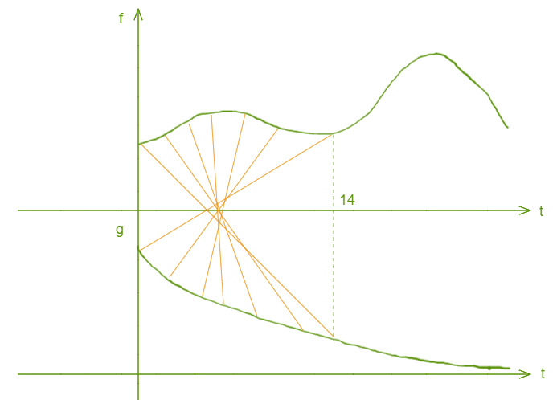
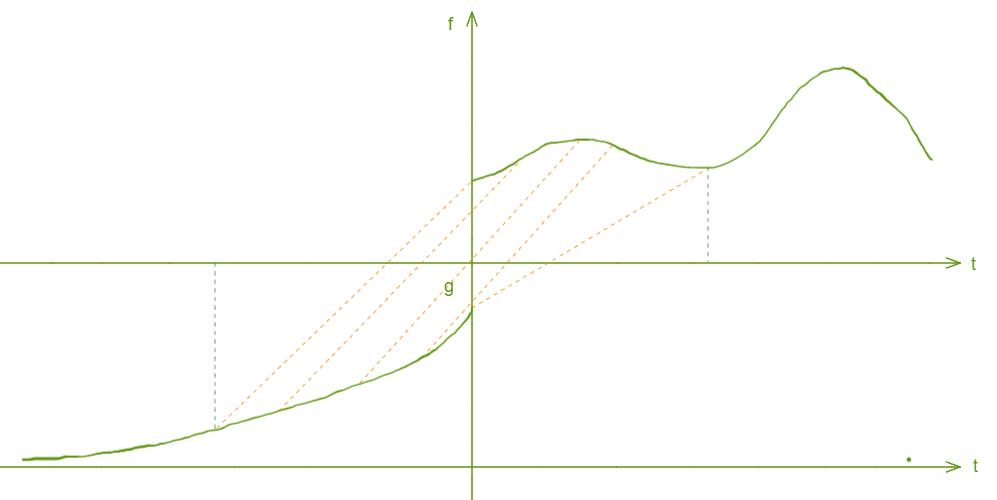
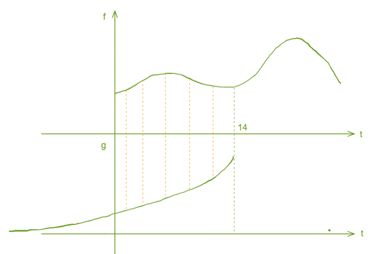

卷积运算

##### 什么是卷积

卷积（convolution），是一种运算，你可以类比于加，减，乘，除，矩阵的点乘与叉乘等等，它有自己的运算规则，卷积的符号是星号`*`。表达式为：

连续的为
$$
(f*g)(n) = \int_{-\infty}^{\infty}f(x)g(n-x)dx
$$
离散的为
$$
(f*g)(n) = \sum_{x=-{\infty}}^{\infty}f(x)g(n-x)
$$
从参数上来看，`x + (n-x) = n`，可以类比为`x + y = n`，也就是说`f, g`的参数满足规律`y = -x + n`，即`g`的参数是`f`的参数先翻转再平移`n`。把`g`从右边褶到左边去，也就是卷积的`卷`的由来。然后在这个位置对两个函数的对应点相乘，然后相加，这个过程是卷积的`积`的过程。

因此卷积的过程可以理解为：翻转，滑动，叠加。其中翻转指的是`g`，滑动指的是`n`值在不断改变。最终将他们相乘相加。

##### 卷积的意义

任何一个公式都有它的现实意义，都需要解决实际问题，通常可以把`f`看成主要部分，`g`看成系数部分或者权重部分。而它们相乘就意味着在特定的`n`下，可以求出`x`的取值范围，进而可以算出`(f*g)(n)`的值。

举个例子，一个人每天在不同的时刻都有进食，同时也会时刻在消化食物，进食曲线为`f`，而胃里剩下的食物的比例为`g`，即在6点吃了食物100克，这块食物在8点时还剩`4/5`，在10点时还剩`1/2`，每一次进食都会对应一条衰减曲线，那么求在14点时胃里还剩多少食物。

我们需要计算出14点之前的每一次进食在14点时刻还剩多少，然后相加即可。我们知道0点进食的衰减了14小时，而14点进食的没有衰减，可以描述如下：



因为进食是离散的，所以结果就等于

```bash
f(0)*g(14) + f(1)*g(13) + ... f(14) * g(0)
```

看起来是拧巴着，如果将`g`函数沿着Y轴翻转一下。



看起来还是很奇怪，如果将`g`向右平移14呢



14只是个特例，要求某一个时刻的值就平移多少。14就是`(f*g)(n)`中的`n`，所以每一个`n`都会得到一个结果。

可见`f`的曲线是固定的，而`g`的曲线随着`n`的变化会移动，往往我们只会求在特定的`n`下的卷积值。如果波形图在x轴不是连续的，那还要分段来计算。

##### 图像处理

我们对图像的`blur`操作，即降噪平滑操作，就是使用的卷积运算，最终的效果取决于卷积核的设置。以单通道卷积为例。

均值卷积核，就是认为目标像素点的值是周围值的平均数，即周围各点对它的影响是一样的，此处卷积核以`3X3`为例。
$$
\begin{bmatrix}
   \frac 1 9\ & \frac 1 9\ & \frac 1 9\ \\
   \frac 1 9\ & \frac 1 9\ & \frac 1 9\ \\
   \frac 1 9\ & \frac 1 9\ & \frac 1 9\
\end{bmatrix}
$$
高斯滤波认为各个像素点距离核中心的距离不一样，导致颜色的贡献程度不一样，因此给不同的点不同的权重。

取图像中的部分像素点
$$
\begin{bmatrix}
   f(0,0) & f(0,1) & f(0,2) & f(0,3) \\
   f(1,0) & f(1,1) & f(1,2) & f(1,3) \\
   f(2,0) & f(2,1) & f(2,2) & f(2,3) \\
   f(3,0) & f(3,1) & f(3,2) & f(3,3) \\
\end{bmatrix}
$$
我们把这个矩阵看成`f(x,y)`函数，下标为参数，像素点的值为函数结果，那么要求`f(1,1)`处的卷积运算结果，因为现在是二维函数了，因此对应的卷积表达式为：
$$
(f*g)(u, v) = \sum f(x, y)g(u-x, v-y)
$$
对应到本例`u=1, v=1`
$$
(f*g)(1, 1) = \sum f(x, y)g(1-x, 1-y)
$$
我们来构建`g(1-x, 1-y)`函数，暂定为`3X3`的矩阵，所以中心点处应该为`g(0,0)`，必须满足下标相加为1，然后我们就可以构建出
$$
\begin{bmatrix}
   g(-1,-1) & g(-1,0) & g(-1,1) \\
   g(0,-1) & g(0,0) & g(0,1) \\
   g(1,-1) & g(1,0) & g(1,1) \\
\end{bmatrix}
$$
有了`g`函数之后，就可以执行运算了，注意运算的时候 f 和 g 的参数要符合卷积公式，即
$$
f0,0)*g(1,1) + f(0,1)*g(1,0) + ...
$$
其实这样就够了，但是便于理解和说明，我们将矩阵先沿着X轴翻转，再沿Y轴翻转，中心点在 g(0,0) 处，得到
$$
\begin{bmatrix}
   g(1,1) & g(1,0) & g(1,-1) \\
   g(0,1) & g(0,0) & g(0,-1) \\
   g(-1,1) & g(-1,0) & g(-1,-1) \\
\end{bmatrix}
$$
注意，这才是卷积核，也就是我们常说的将卷积核盖在目标像素点上面，将对应的像素点相乘相加的由来。如果不翻转。那么这个说法将不成立。当然我们也可以直接构建这个最终的矩阵，因为在这里矩阵本身没有什么意义只是为了存放`g`函数的散列值。

剩下的就是卷积计算了，将结果赋值给`f(1,1)`即可。然后向右平移一格，达到边界后向下平移一格继续从左边开始卷积。你会发现整个过程中最外一层无法被算到，没关系，将原图像向外扩大一圈像素点并设置为0（因为它们本身就不存在，因此对中心像素点没有贡献），然后计算卷积就行了。

通过设置不同的卷积核来达到不同的结果，这是机器视觉的基础操作。